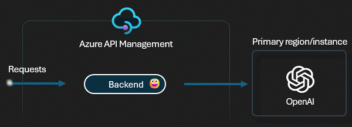
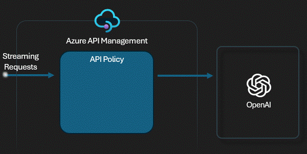
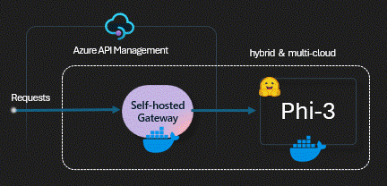
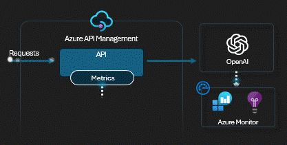

# APIM ❤️ OpenAI

## Contents
1. [🧠 AI Gateway](#-ai-gateway)
2. [🧪 Labs](#-labs)
3. [🚀 Getting started](#-getting-started)
4. [🏛️ Well Architected Framework](#-well-architected-framework)
5. [🪞 Mock Server](#-mock-server)
6. [🎒 Show and tell](#-show-and-tell)
7. [🥇 Other Resources](#-other-resources)

The rapid pace of AI advances demands experimentation-driven approaches for organizations to remain at the forefront of the industry. With AI steadily becoming a game-changer for an array of sectors, maintaining a fast-paced innovation trajectory is crucial for businesses aiming to leverage its full potential. 

__AI services__ are predominantly accessed via __APIs__, underscoring the essential need for a robust and efficient API management strategy. This strategy is instrumental for maintaining control and governance over the consumption of __AI services__.

With the expanding horizons of __AI services__ and their seamless integration with __APIs__, there is a considerable demand for a comprehensive __AI Gateway__ pattern, which broadens the core principles of API management. Aiming to accelerate the experimentation of advanced use cases and pave the road for further innovation in this rapidly evolving field. The well-architected principles of the __AI Gateway__ provides a framework for the confident deployment of __Intelligent Apps__ into production..

## 🧠 AI Gateway

This repo explores the __AI Gateway__ pattern through a series of experimental labs. [Azure API Management](https://learn.microsoft.com/en-us/azure/api-management/api-management-key-concepts) plays a crucial role within these labs, handling AI services APIs, with security, reliability, performance, overall operational efficiency and cost controls. The primary focus is on [Azure OpenAI](https://learn.microsoft.com/en-us/azure/ai-services/openai/overview), which sets the standard reference for Large Language Models (LLM). However, the same principles and design patterns could potentially be applied to any LLM.

## 🧪 Labs

Acknowledging the rising dominance of Python, particularly in the realm of AI, along with the powerful experimental capabilities of Jupyter notebooks, the following labs are structured around Jupyter notebooks, with step-by-step instructions with Python scripts, Bicep files and APIM policies:

|  |  | | |
| ---- | ----- | ----------- | -- |
| [Request forwarding](labs/request-forwarding/request-forwarding.ipynb) |  | Playground to try forwarding requests to either an Azure OpenAI endpoint or a mock server. APIM uses the system [managed identity](https://learn.microsoft.com/en-us/azure/api-management/api-management-howto-use-managed-service-identity) to authenticate into the Azure OpenAI service. | [💬](../../issues/11 "Discussion") |
| [Backend circuit breaking](labs/backend-circuit-breaking/backend-circuit-breaking.ipynb)     |  | Playground to try the built-in [backend circuit breaker functionality of APIM](https://learn.microsoft.com/en-us/azure/api-management/backends?tabs=bicep) to either an Azure OpenAI endpoints or a mock server. | [💬](../../issues/15 "Discussion") |
| [Backend pool load balancing](labs/backend-pool-load-balancing/backend-pool-load-balancing.ipynb) |  | Playground to try the built-in load balancing [backend pool functionality of APIM](https://learn.microsoft.com/en-us/azure/api-management/backends?tabs=bicep) to either a list of Azure OpenAI endpoints or mock servers. | [💬](../../issues/16 "Discussion") |
| [Advanced load balancing](labs/advanced-load-balancing/advanced-load-balancing.ipynb) |  | Playground to try the advanced load balancing (based on a custom [APIM policy](https://learn.microsoft.com/en-us/azure/api-management/api-management-howto-policies)) to either a list of Azure OpenAI endpoints or mock servers. | [💬](../../issues/17 "Discussion") |
| [Response streaming](labs/response-streaming/response-streaming.ipynb) |  | Playground to try response streaming with APIM and Azure OpenAI endpoints to explore the advantages and shortcomings associated with [streaming](https://learn.microsoft.com/en-us/azure/api-management/how-to-server-sent-events#guidelines-for-sse). | [💬](../../issues/18 "Discussion") |
| [Vector searching](labs/vector-searching/vector-searching.ipynb) |  | Playground to try the [Retrieval Augmented Generation (RAG) pattern](https://learn.microsoft.com/en-us/azure/search/retrieval-augmented-generation-overview) with Azure AI Search, Azure OpenAI embeddings and Azure OpenAI completions. All the endpoints are managed via APIM. | [💬](../../issues/19 "Discussion") |
| [Built-in logging](labs/built-in-logging/built-in-logging.ipynb) |  | Playground to try the [buil-in logging capabilities of API Management](https://learn.microsoft.com/en-us/azure/api-management/observability). The requests are logged into Application Insights and it's easy to track request/response details and token usage with provided notebook.  | [💬](../../issues/20 "Discussion") |
| [SLM self-hosting](labs/slm-self-hosting/slm-self-hosting.ipynb) |  | Playground to try the self-hosted [phy-3 Small Language Model (SLM)](https://azure.microsoft.com/en-us/blog/introducing-phi-3-redefining-whats-possible-with-slms/) trough the [APIM self-hosted gateway](https://learn.microsoft.com/en-us/azure/api-management/self-hosted-gateway-overview) with OpenAI API compatibility.  | [💬](../../issues/21 "Discussion") |
| [Access controlling](labs/access-controlling/access-controlling.ipynb) |  | Playground to try the [OAuth 2.0 authorization feature](https://learn.microsoft.com/en-us/azure/api-management/api-management-authenticate-authorize-azure-openai#oauth-20-authorization-using-identity-provider) using identity provider to enable more fine-grained access to OpenAPI APIs by particular users or client. | [💬](../../issues/25 "Discussion") |
| [Token rate limiting](labs/token-rate-limiting/token-rate-limiting.ipynb) |  | Playground to try the [token rate limiting policy](https://learn.microsoft.com/en-us/azure/api-management/azure-openai-token-limit-policy) to either a list of Azure OpenAI endpoints or mock servers. | [💬](../../issues/26 "Discussion") |
| [Semantic caching](labs/semantic-caching/semantic-caching.ipynb) |  | Playground to try the [sementic caching policy](https://learn.microsoft.com/en-us/azure/api-management/azure-openai-semantic-cache-lookup-policy).  | [💬](../../issues/27 "Discussion") |
| [Token metrics emitting](labs/token-metrics-emitting/token-metrics-emitting.ipynb) |  | Playground to try the [emit token metric policy](https://learn.microsoft.com/en-us/azure/api-management/azure-openai-emit-token-metric-policy). The policy sends metrics to Application Insights about consumption of large language model tokens through Azure OpenAI Service APIs.  | [💬](../../issues/28 "Discussion") |
| [GPT-4o inferencing](labs/GPT-4o-inferencing/GPT-4o-inferencing.ipynb) |  | Playground to try the new GPT-4o model. GPT-4o ("o" for "omni") is designed to handle a combination of text, audio, and video inputs, and can generate outputs in text, audio, and image formats.  | [💬](../../issues/29 "Discussion") |

### Backlog of experiments
* Developer tooling
* App building
* Token counting
* Function calling
* Assistants load balancing
* Semantic Kernel plugin
* Cost tracking
* Content filtering
* PII handling
* Prompt storing
* Prompt guarding
* Prompt model routing
* Llama inferencing

> [!TIP]
> Kindly use [the feedback discussion](../../discussions/9) so that we can continuously improve with your experiences, suggestions, ideas or lab requests.

## 🚀 Getting Started

### Prerequisites
- [Python 3.8 or later version](https://www.python.org/) installed
- [VS Code](https://code.visualstudio.com/) installed with the [Jupyter notebook extension](https://marketplace.visualstudio.com/items?itemName=ms-toolsai.jupyter) enabled
- [Azure CLI](https://learn.microsoft.com/en-us/cli/azure/install-azure-cli) installed
- [An Azure Subscription](https://azure.microsoft.com/en-us/free/) with Contributor permissions
- [Access granted to Azure OpenAI](https://aka.ms/oai/access) or just enable the mock service
- [Sign in to Azure with Azure CLI](https://learn.microsoft.com/en-us/cli/azure/authenticate-azure-cli-interactively)

### Quickstart
1. Clone this repo and configure your local machine with the prerequisites. Or just create a [GitHub Codespace](https://codespaces.new/Azure-Samples/AI-Gateway/tree/main) and run it on the browser or in VS Code.
2. Navigate through the available labs and select one that best suits your needs. For starters we recommend the [request forwarding](labs/request-forwarding/request-forwarding.ipynb) with just the Azure CLI or the [backend pool load balancing](labs/backend-pool-load-balancing/backend-pool-load-balancing.ipynb) with Bicep.
3. Open the notebook and run the provided steps.
4. Tailor the experiment according to your requirements. If you wish to contribute to our collective work, we would appreciate your [submission of a pull request](CONTRIBUTING.MD).

> [!NOTE]
> 🪲 Please feel free to open a new [issue](../../issues/new) if you find something that should be fixed or enhanced.

## 🏛️ Well-Architected Framework

The [Azure Well-Architected Framework](https://learn.microsoft.com/en-us/azure/well-architected/what-is-well-architected-framework) is a design framework that can improve the quality of a workload. The following table maps labs with the Well-Architected Framework pillars to set you up for success through architectural experimentation.

| Lab  | Security | Reliability | Performance | Operations | Costs |
| -------- | -------- |-------- |-------- |-------- |-------- |
| [Request forwarding](labs/request-forwarding/request-forwarding.ipynb) | [⭐](#%EF%B8%8F-well-architected-framework "Zero trust, keyless approach with manage identities and APIM security features") | |  |  |  |
| [Backend circuit breaking](labs/backend-circuit-breaking/backend-circuit-breaking.ipynb) | [⭐](#%EF%B8%8F-well-architected-framework "Zero trust, keyless approach with manage identities and APIM security features") | [⭐](#%EF%B8%8F-well-architected-framework "Controls the availability of the OpenAI endpoint with the circuit breaker feature") |  |  |  |
| [Backend pool load balancing](labs/backend-pool-load-balancing/backend-pool-load-balancing.ipynb)  |[⭐](#%EF%B8%8F-well-architected-framework "Zero trust, keyless approach with manage identities and APIM security features")|[⭐](#%EF%B8%8F-well-architected-framework "To ensure resilience, the request is distributed to two or more endpoints with the built-in feature")|[⭐](#%EF%B8%8F-well-architected-framework "Load balances the requests to increase performance with the built-in feature")|  |  |
| [Advanced load balancing](labs/advanced-load-balancing/advanced-load-balancing.ipynb) |[⭐](#%EF%B8%8F-well-architected-framework "Zero trust, keyless approach with manage identities and APIM security features")|[⭐](#%EF%B8%8F-well-architected-framework "To ensure resilience, the request is distributed to two or more endpoints with a custom policy")|[⭐](#%EF%B8%8F-well-architected-framework "Load balances the requests to increase performance with a custom policy")|  |  |
| [Response streaming](labs/response-streaming/response-streaming.ipynb)  |[⭐](#%EF%B8%8F-well-architected-framework "Zero trust, keyless approach with manage identities and APIM security features")| |[⭐](#%EF%B8%8F-well-architected-framework "To get responses sooner, you can 'stream' the completion as it's being generated")|  |  |
| [Vector searching](labs/vector-searching/vector-searching.ipynb) |[⭐](#%EF%B8%8F-well-architected-framework "Zero trust, keyless approach with manage identities and APIM security features")|[⭐](#%EF%B8%8F-well-architected-framework "To ensure resilience, the request is distributed to two or more endpoints with the built-in feature")| [⭐](#%EF%B8%8F-well-architected-framework "Load balances the requests to increase performance with the built-in feature")| |  |
| [Built-in logging](labs/built-in-logging/built-in-logging.ipynb) |[⭐](#%EF%B8%8F-well-architected-framework "Zero trust, keyless approach with manage identities and APIM security features")|[⭐](#%EF%B8%8F-well-architected-framework "To ensure resilience, the request is distributed to two or more endpoints with the built-in feature")|[⭐](#%EF%B8%8F-well-architected-framework "Load balances the requests to increase performance with the built-in feature")|[⭐](#%EF%B8%8F-well-architected-framework "Requests are logged to enable monitoring, alerting and automatic remediation")|[⭐](#%EF%B8%8F-well-architected-framework "Relation between APIM subscription and token consumption allows cost control")|
| [SLM self-hosting](labs/slm-self-hosting/slm-self-hosting.ipynb) |[⭐](#%EF%B8%8F-well-architected-framework "Self hosting the model might improve the security posture with network restrictions") | | [⭐](#%EF%B8%8F-well-architected-framework "Performance might be improved with full control to the self-hosted model") | | |

> [!TIP]
> Check the [Azure Well-Architected Framework perspective on Azure OpenAI Service](https://learn.microsoft.com/en-us/azure/well-architected/service-guides/azure-openai) for aditional guidance.

## 🪞 Mock Server

The AI-Gateway Mock server is designed to mimic the behavior and responses of the OpenAI API, thereby creating an efficient simulation environment suitable for testing and development purposes on the integration with APIM and other use cases.
The [app.py](app.py) can be customized to tailor the Mock server to specific use cases.

* [Run locally or deploy to Azure](mock-server/mock-server.ipynb)

## 🎒 Show and tell
> [!TIP]
> Install the [VS Code Reveal extension](https://marketplace.visualstudio.com/items?itemName=evilz.vscode-reveal), open AI-GATEWAY.md and click on 'slides' at the botton to present the AI Gateway without leaving VS Code.
> Or just open the [AI-GATEWAY.pptx](https://view.officeapps.live.com/op/view.aspx?src=https%3A%2F%2Fraw.githubusercontent.com%2FAzure-Samples%2FAI-Gateway%2Fmain%2FAI-GATEWAY.pptx&wdOrigin=BROWSELINK) for a plain old PowerPoint experience.

## 🥇 Other resources

Numerous reference architectures, best practices and starter kits are available on this topic. Please refer to the resources provided if you need comprehensive solutions or a landing zone to initiate your project. We suggest leveraging the AI-Gateway labs to discover additional capabilities that can be integrated into the reference architectures.

- [AI Hub Gateway Landing Zone](https://github.com/Azure-Samples/ai-hub-gateway-solution-accelerator)
- [Designing and implementing a gateway solution with Azure OpenAI resources](https://aka.ms/genai-gateway)
- [Azure OpenAI Using PTUs/TPMs With API Management - Using the Scaling Special Sauce](https://github.com/Azure/aoai-apim)
- [Manage Azure OpenAI using APIM](https://github.com/microsoft/AzureOpenAI-with-APIM) 
- [Setting up Azure OpenAI as a central capability with Azure API Management](https://github.com/Azure/enterprise-azureai)
- [Introduction to Building AI Apps](https://github.com/Azure/intro-to-intelligent-apps)

> We believe that there may be valuable content that we are currently unaware of. We would greatly appreciate any suggestions or recommendations to enhance this list.

### 🌐 WW GBB initiative

### Disclaimer
> [!IMPORTANT]
> This software is provided for demonstration purposes only. It is not intended to be relied upon for any purpose. The creators of this software make no representations or warranties of any kind, express or implied, about the completeness, accuracy, reliability, suitability or availability with respect to the software or the information, products, services, or related graphics contained in the software for any purpose. Any reliance you place on such information is therefore strictly at your own risk.