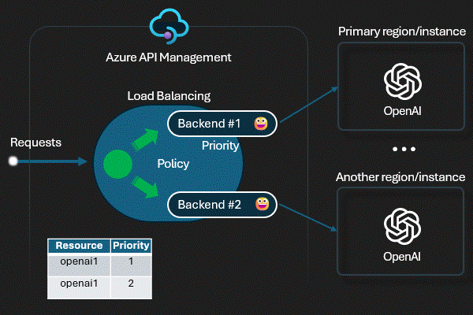
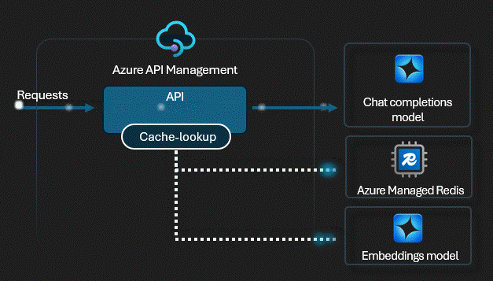

# APIM ❤️ OpenAI - 🧪 Labs for the [GenAI Gateway capabilities](https://techcommunity.microsoft.com/t5/azure-integration-services-blog/introducing-genai-gateway-capabilities-in-azure-api-management/ba-p/4146525) of [Azure API Management](https://learn.microsoft.com/en-us/azure/api-management/api-management-key-concepts)

## What's new ✨
➕ `priority` and `weight` parameters to the [**Backend pool load balancing**](labs/backend-pool-load-balancing/backend-pool-load-balancing.ipynb) lab.  
➕ the [**Streaming**](streaming.ipynb) tool to test OpenAI streaming with Azure API Management.  
➕ the [**Tracing**](tools/tracing.ipynb) tool to debug and troubleshoot OpenAI APIs using [Azure API Management tracing capability](https://learn.microsoft.com/en-us/azure/api-management/api-management-howto-api-inspector).  
➕ image processing to the [**GPT-4o inferencing**](labs/GPT-4o-inferencing/GPT-4o-inferencing.ipynb) lab.  
➕ the [**Function calling**](labs/function-calling/function-calling.ipynb) lab with a sample API on Azure Functions.  

## Contents
1. [🧠 GenAI Gateway](#-genai-gateway)
2. [🧪 Labs](#-labs)
3. [🚀 Getting started](#-getting-started)
5. [🔨 Tools](#-tools)
4. [🏛️ Well Architected Framework](#-well-architected-framework)
6. [🎒 Show and tell](#-show-and-tell)
7. [🥇 Other Resources](#-other-resources)

The rapid pace of AI advances demands experimentation-driven approaches for organizations to remain at the forefront of the industry. With AI steadily becoming a game-changer for an array of sectors, maintaining a fast-paced innovation trajectory is crucial for businesses aiming to leverage its full potential. 

__AI services__ are predominantly accessed via __APIs__, underscoring the essential need for a robust and efficient API management strategy. This strategy is instrumental for maintaining control and governance over the consumption of __AI services__.

With the expanding horizons of __AI services__ and their seamless integration with __APIs__, there is a considerable demand for a comprehensive __AI Gateway__ pattern, which broadens the core principles of API management. Aiming to accelerate the experimentation of advanced use cases and pave the road for further innovation in this rapidly evolving field. The well-architected principles of the __AI Gateway__ provides a framework for the confident deployment of __Intelligent Apps__ into production.

## 🧠 GenAI Gateway

This repo explores the __AI Gateway__ pattern through a series of experimental labs. The [GenAI Gateway capabilities](https://techcommunity.microsoft.com/t5/azure-integration-services-blog/introducing-genai-gateway-capabilities-in-azure-api-management/ba-p/4146525) of [Azure API Management](https://learn.microsoft.com/en-us/azure/api-management/api-management-key-concepts) plays a crucial role within these labs, handling AI services APIs, with security, reliability, performance, overall operational efficiency and cost controls. The primary focus is on [Azure OpenAI](https://learn.microsoft.com/en-us/azure/ai-services/openai/overview), which sets the standard reference for Large Language Models (LLM). However, the same principles and design patterns could potentially be applied to any LLM.

## 🧪 Labs

Acknowledging the rising dominance of Python, particularly in the realm of AI, along with the powerful experimental capabilities of Jupyter notebooks, the following labs are structured around Jupyter notebooks, with step-by-step instructions with Python scripts, [Bicep](https://learn.microsoft.com/en-us/azure/azure-resource-manager/bicep/overview?tabs=bicep) files and [Azure API Management policies](https://learn.microsoft.com/en-us/azure/api-management/api-management-howto-policies):

| [**Backend pool load balancing**](labs/backend-pool-load-balancing/backend-pool-load-balancing.ipynb) (built-in) | [**Advanced load balancing**](labs/advanced-load-balancing/advanced-load-balancing.ipynb) (custom) |
| -- | -- |
|  |  |
| Playground to try the built-in load balancing [backend pool functionality of Azure API Management](https://learn.microsoft.com/en-us/azure/api-management/backends?tabs=bicep) to either a list of Azure OpenAI endpoints or mock servers. [💬](../../issues/16 "Discussion") | Playground to try the advanced load balancing (based on a custom [Azure API Management policy](https://learn.microsoft.com/en-us/azure/api-management/api-management-howto-policies)) to either a list of Azure OpenAI endpoints or mock servers. [💬](../../issues/17 "Discussion") |

| [**Response streaming**](labs/response-streaming/response-streaming.ipynb) | [**Vector searching**](labs/vector-searching/vector-searching.ipynb) |
| -- | -- |
|  |  |
| Playground to try response streaming with Azure API Management and Azure OpenAI endpoints to explore the advantages and shortcomings associated with [streaming](https://learn.microsoft.com/en-us/azure/api-management/how-to-server-sent-events#guidelines-for-sse). [💬](../../issues/18 "Discussion") | Playground to try the [Retrieval Augmented Generation (RAG) pattern](https://learn.microsoft.com/en-us/azure/search/retrieval-augmented-generation-overview) with Azure AI Search, Azure OpenAI embeddings and Azure OpenAI completions. [💬](../../issues/19 "Discussion") |
 
| [**Built-in logging**](labs/built-in-logging/built-in-logging.ipynb) | [**SLM self-hosting**](labs/slm-self-hosting/slm-self-hosting.ipynb) (phy-3) |
| -- | -- |
|  |  |
| Playground to try the [buil-in logging capabilities of Azure API Management](https://learn.microsoft.com/en-us/azure/api-management/observability). Logs requests into App Insights to track details and token usage. [💬](../../issues/20 "Discussion") | Playground to try the self-hosted [phy-3 Small Language Model (SLM)](https://azure.microsoft.com/en-us/blog/introducing-phi-3-redefining-whats-possible-with-slms/) trough the [Azure API Management self-hosted gateway](https://learn.microsoft.com/en-us/azure/api-management/self-hosted-gateway-overview) with OpenAI API compatibility. [💬](../../issues/21 "Discussion") |

| [**Access controlling**](labs/access-controlling/access-controlling.ipynb) | [**Token rate limiting**](labs/token-rate-limiting/token-rate-limiting.ipynb) |
| -- | -- |
|  |  |
| Playground to try the [OAuth 2.0 authorization feature](https://learn.microsoft.com/en-us/azure/api-management/api-management-authenticate-authorize-azure-openai#oauth-20-authorization-using-identity-provider) using identity provider to enable more fine-grained access to OpenAPI APIs by particular users or client. [💬](../../issues/25 "Discussion") |  Playground to try the [token rate limiting policy](https://learn.microsoft.com/en-us/azure/api-management/azure-openai-token-limit-policy) to one or more Azure OpenAI endpoints. When the token usage is exceeded, the caller receives a 429. [💬](../../issues/26 "Discussion") |

| [**Semantic caching**](labs/semantic-caching/semantic-caching.ipynb) | [**Token metrics emitting**](labs/token-metrics-emitting/token-metrics-emitting.ipynb) |
| -- | -- |
|  |  |
| Playground to try the [sementic caching policy](https://learn.microsoft.com/en-us/azure/api-management/azure-openai-semantic-cache-lookup-policy). Uses vector proximity of the prompt to previous requests and a specified similarity score threshold. [💬](../../issues/27 "Discussion") | Playground to try the [emit token metric policy](https://learn.microsoft.com/en-us/azure/api-management/azure-openai-emit-token-metric-policy). The policy sends metrics to Application Insights about consumption of large language model tokens through Azure OpenAI Service APIs. [💬](../../issues/28 "Discussion") |

| [**GPT-4o inferencing**](labs/GPT-4o-inferencing/GPT-4o-inferencing.ipynb) | [**Message storing**](labs/message-storing/message-storing.ipynb) |
| -- | -- |
|   |  |
| Playground to try the new GPT-4o model. GPT-4o ("o" for "omni") is designed to handle a combination of text, audio, and video inputs, and can generate outputs in text, audio, and image formats.  [💬](../../issues/29 "Discussion") | Playground to test storimg message details into Cosmos DB through the [Log to event hub](https://learn.microsoft.com/en-us/azure/api-management/log-to-eventhub-policy) policy. With the policy we can control which data will be stored in the DB (prompt, completion, model, region, tokens etc.).  |

| [**Developer tooling** (WIP)](labs/developer-tooling/developer-tooling.ipynb) | [**Function calling**](labs/function-calling/function-calling.ipynb) |
| -- | -- |
|   |  |
| Playground to try the developer tooling available with Azure API Management to develop, debug, test and publish AI Service APIs. | Playground to try the OpenAI [function calling](https://learn.microsoft.com/en-us/azure/ai-services/openai/how-to/function-calling?tabs=non-streaming%2Cpython) feature with an Azure Functions API that is also managed by Azure API Management.  |

### Backlog of experiments
* Assistants load balancing
* Semantic Kernel plugin
* Content filtering
* PII handling
* Prompt guarding
* Prompt model routing
* Llama inferencing

> [!TIP]
> Kindly use [the feedback discussion](../../discussions/9) so that we can continuously improve with your experiences, suggestions, ideas or lab requests.

## 🚀 Getting Started

### Prerequisites
- [Python 3.8 or later version](https://www.python.org/) installed
- [VS Code](https://code.visualstudio.com/) installed with the [Jupyter notebook extension](https://marketplace.visualstudio.com/items?itemName=ms-toolsai.jupyter) enabled
- [Azure CLI](https://learn.microsoft.com/en-us/cli/azure/install-azure-cli) installed
- [An Azure Subscription](https://azure.microsoft.com/en-us/free/) with Contributor permissions
- [Access granted to Azure OpenAI](https://aka.ms/oai/access) or just enable the mock service
- [Sign in to Azure with Azure CLI](https://learn.microsoft.com/en-us/cli/azure/authenticate-azure-cli-interactively)

### Quickstart
1. Clone this repo and configure your local machine with the prerequisites. Or just create a [GitHub Codespace](https://codespaces.new/Azure-Samples/AI-Gateway/tree/main) and run it on the browser or in VS Code.
2. Navigate through the available labs and select one that best suits your needs. For starters we recommend the [backend pool load balancing](labs/backend-pool-load-balancing/backend-pool-load-balancing.ipynb).
3. Open the notebook and run the provided steps.
4. Tailor the experiment according to your requirements. If you wish to contribute to our collective work, we would appreciate your [submission of a pull request](CONTRIBUTING.MD).

> [!NOTE]
> 🪲 Please feel free to open a new [issue](../../issues/new) if you find something that should be fixed or enhanced.

## 🔨 Tools

- [AI-Gateway Mock server](tools/mock-server/mock-server.ipynb) is designed to mimic the behavior and responses of the OpenAI API, thereby creating an efficient simulation environment suitable for testing and development purposes on the integration with Azure API Management and other use cases. The [app.py](tools/mock-server/app.py) can be customized to tailor the Mock server to specific use cases.
- [Tracing](tools/tracing.ipynb) - Invoke OpenAI API with trace enabled and returns the tracing information.
- [Streaming](streaming.ipynb) - Invoke OpenAI API with stream enabled and returns response in chunks.

## 🏛️ Well-Architected Framework

The [Azure Well-Architected Framework](https://learn.microsoft.com/en-us/azure/well-architected/what-is-well-architected-framework) is a design framework that can improve the quality of a workload. The following table maps labs with the Well-Architected Framework pillars to set you up for success through architectural experimentation.

| Lab  | Security | Reliability | Performance | Operations | Costs |
| -------- | -------- |-------- |-------- |-------- |-------- |
| [Request forwarding](labs/request-forwarding/request-forwarding.ipynb) | [⭐](#%EF%B8%8F-well-architected-framework "Zero trust, keyless approach with manage identities and Azure API Management security features") | |  |  |  |
| [Backend circuit breaking](labs/backend-circuit-breaking/backend-circuit-breaking.ipynb) | [⭐](#%EF%B8%8F-well-architected-framework "Zero trust, keyless approach with manage identities and Azure API Management security features") | [⭐](#%EF%B8%8F-well-architected-framework "Controls the availability of the OpenAI endpoint with the circuit breaker feature") |  |  |  |
| [Backend pool load balancing](labs/backend-pool-load-balancing/backend-pool-load-balancing.ipynb)  |[⭐](#%EF%B8%8F-well-architected-framework "Zero trust, keyless approach with manage identities and Azure API Management security features")|[⭐](#%EF%B8%8F-well-architected-framework "To ensure resilience, the request is distributed to two or more endpoints with the built-in feature")|[⭐](#%EF%B8%8F-well-architected-framework "Load balances the requests to increase performance with the built-in feature")|  |  |
| [Advanced load balancing](labs/advanced-load-balancing/advanced-load-balancing.ipynb) |[⭐](#%EF%B8%8F-well-architected-framework "Zero trust, keyless approach with manage identities and Azure API Management security features")|[⭐](#%EF%B8%8F-well-architected-framework "To ensure resilience, the request is distributed to two or more endpoints with a custom policy")|[⭐](#%EF%B8%8F-well-architected-framework "Load balances the requests to increase performance with a custom policy")|  |  |
| [Response streaming](labs/response-streaming/response-streaming.ipynb)  |[⭐](#%EF%B8%8F-well-architected-framework "Zero trust, keyless approach with manage identities and Azure API Management security features")| |[⭐](#%EF%B8%8F-well-architected-framework "To get responses sooner, you can 'stream' the completion as it's being generated")|  |  |
| [Vector searching](labs/vector-searching/vector-searching.ipynb) |[⭐](#%EF%B8%8F-well-architected-framework "Zero trust, keyless approach with manage identities and Azure API Management security features")|[⭐](#%EF%B8%8F-well-architected-framework "To ensure resilience, the request is distributed to two or more endpoints with the built-in feature")| [⭐](#%EF%B8%8F-well-architected-framework "Load balances the requests to increase performance with the built-in feature")| |  |
| [Built-in logging](labs/built-in-logging/built-in-logging.ipynb) |[⭐](#%EF%B8%8F-well-architected-framework "Zero trust, keyless approach with manage identities and Azure API Management security features")|[⭐](#%EF%B8%8F-well-architected-framework "To ensure resilience, the request is distributed to two or more endpoints with the built-in feature")|[⭐](#%EF%B8%8F-well-architected-framework "Load balances the requests to increase performance with the built-in feature")|[⭐](#%EF%B8%8F-well-architected-framework "Requests are logged to enable monitoring, alerting and automatic remediation")|[⭐](#%EF%B8%8F-well-architected-framework "Relation between Azure API Management subscription and token consumption allows cost control")|
| [SLM self-hosting](labs/slm-self-hosting/slm-self-hosting.ipynb) |[⭐](#%EF%B8%8F-well-architected-framework "Self hosting the model might improve the security posture with network restrictions") | | [⭐](#%EF%B8%8F-well-architected-framework "Performance might be improved with full control to the self-hosted model") | | |

> [!TIP]
> Check the [Azure Well-Architected Framework perspective on Azure OpenAI Service](https://learn.microsoft.com/en-us/azure/well-architected/service-guides/azure-openai) for aditional guidance.

## 🎒 Show and tell
> [!TIP]
> Install the [VS Code Reveal extension](https://marketplace.visualstudio.com/items?itemName=evilz.vscode-reveal), open AI-GATEWAY.md and click on 'slides' at the botton to present the AI Gateway without leaving VS Code.
> Or just open the [AI-GATEWAY.pptx](https://view.officeapps.live.com/op/view.aspx?src=https%3A%2F%2Fraw.githubusercontent.com%2FAzure-Samples%2FAI-Gateway%2Fmain%2FAI-GATEWAY.pptx&wdOrigin=BROWSELINK) for a plain old PowerPoint experience.

## 🥇 Other resources

Numerous reference architectures, best practices and starter kits are available on this topic. Please refer to the resources provided if you need comprehensive solutions or a landing zone to initiate your project. We suggest leveraging the AI-Gateway labs to discover additional capabilities that can be integrated into the reference architectures.

- [AI Hub Gateway Landing Zone](https://github.com/Azure-Samples/ai-hub-gateway-solution-accelerator)
- [GenAI Gateway Guide](https://aka.ms/genai-gateway)
- [Azure OpenAI + APIM Sample](https://aka.ms/apim/genai/sample-app)
- [AI+API better together: Benefits & Best Practices using APIs for AI workloads](https://techcommunity.microsoft.com/t5/apps-on-azure-blog/ai-api-better-together-benefits-amp-best-practices-using-apis/ba-p/4157120)
- [Designing and implementing a gateway solution with Azure OpenAI resources](https://aka.ms/genai-gateway)
- [Azure OpenAI Using PTUs/TPMs With API Management - Using the Scaling Special Sauce](https://github.com/Azure/aoai-apim)
- [Manage Azure OpenAI using APIM](https://github.com/microsoft/AzureOpenAI-with-APIM) 
- [Setting up Azure OpenAI as a central capability with Azure API Management](https://github.com/Azure/enterprise-azureai)
- [Introduction to Building AI Apps](https://github.com/Azure/intro-to-intelligent-apps)

> We believe that there may be valuable content that we are currently unaware of. We would greatly appreciate any suggestions or recommendations to enhance this list.

### 🌐 WW GBB initiative

### Disclaimer
> [!IMPORTANT]
> This software is provided for demonstration purposes only. It is not intended to be relied upon for any purpose. The creators of this software make no representations or warranties of any kind, express or implied, about the completeness, accuracy, reliability, suitability or availability with respect to the software or the information, products, services, or related graphics contained in the software for any purpose. Any reliance you place on such information is therefore strictly at your own risk.